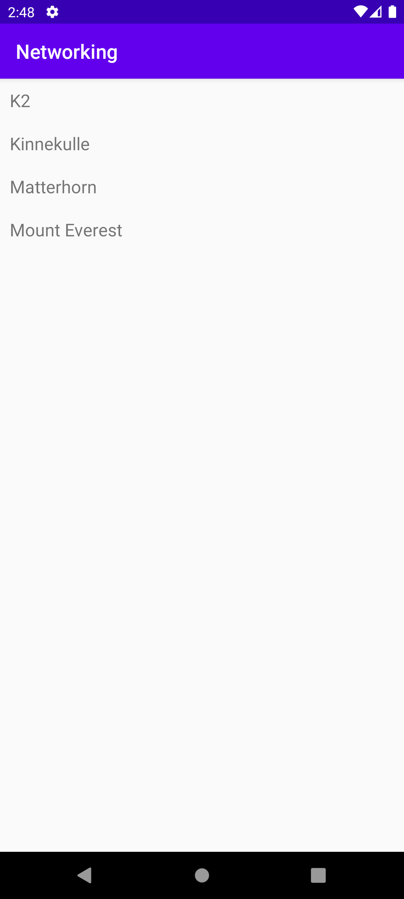

# Rapport

I started with adding a recyclerView to the layout. And the RecyclerViewAdapter class from lenaSYS. 

```
<LinearLayout xmlns:android="http://schemas.android.com/apk/res/android"
    android:layout_width="match_parent"
    android:layout_height="wrap_content"
    android:orientation="horizontal"
    android:padding="10dp">

    <TextView
        android:id="@+id/title"
        android:layout_width="wrap_content"
        android:layout_height="wrap_content"
        android:textSize="18sp"/>

</LinearLayout>
```
Then i moved on and created a mountain class and added constructors and getters/setters. I also added an @Override to the toString method.
```
public class Mountain {
    private String name;
    private String location;
    private int height;

    public Mountain() {
        name="No Name";
        location="No Location";
        height=-1;
    }
    public Mountain(String name, String location, int height) {
        this.name = name;
        this.location = location;
        this.height= height;
    }

    public void setName(String name) {
        this.name = name;
    }

    public String getName() {
        return this.name;
    }
    @Override
    public String toString(){
        return name;
    }
}
```
In onCreate i instanced a ArrayList to hold my mountains in addition to this is a created a new JsonTask with the provided url to fetch my data.
```
private final String JSON_URL = "https://mobprog.webug.se/json-api?login=brom";
ArrayList<Mountain> mountains;
...
@Override
protected void onCreate(Bundle savedInstanceState) {
    ArrayList<Mountain> mountains = new ArrayList<>();
    new JsonTask(this).execute(JSON_URL);
}
```
Then in onPostExecute i parse the data using JSON and add it to the mountains array. I then create the adapter, and add it to the view using findViewById with setAdapter().
I get the feeling this is the wrong way of doing it, since from what ive seen from the examples on LeanSYS is that the adapter should be created and added in onCreate and then when the "onPostExecute" method is called we should call the method notifyDataSetChanged. 
So each time the data updates we don't have to create a new adapter. 
But this was the only way i could get it to actually work. When i tried it using the local JSON file i had no issues, but then also the "onPostExecute" was not needed.

```
    public void onPostExecute(String json) {

        Log.d("MainActivity", json);

        Gson gson = new Gson();
        Type type = new TypeToken<List<Mountain>>() {}.getType();
        mountains = gson.fromJson(json, type);

        Log.d("MainActivity", mountains.toString());

        adapter = new RecyclerViewAdapter(this, mountains, new RecyclerViewAdapter.OnClickListener() {
            @Override
            public void onClick(Mountain item) {
                Toast.makeText(MainActivity.this, item.getName(), Toast.LENGTH_SHORT).show();
            }
        });

        RecyclerView view = findViewById(R.id.recycler_view);
        view.setLayoutManager(new LinearLayoutManager(getApplicationContext()));
        view.setAdapter(adapter);

        this.adapter.notifyDataSetChanged();

    }

```


